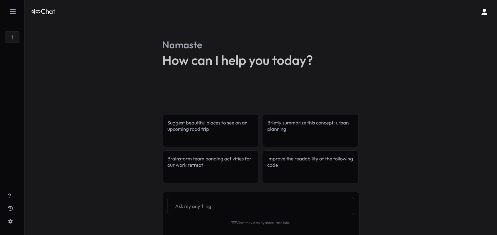
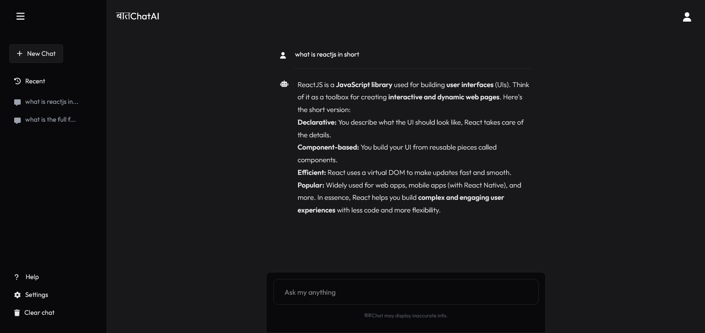

# BakChat
BakChat is a Generative AI chatbot built using Gemini API and Reactjs.

## Screenshots


<br/>


## Table of Contents

- [Installation](#installation)
- [Environment Setup](#environment-setup)
- [Usage](#usage)
- [Contributing](#contributing)
- [License](#license)

## Installation

To get started with this project, clone the repository and install the necessary dependencies:

```bash
git clone https://github.com/ashish0kumar/BakChat.git
cd BakChat
npm install
```

## Environment Setup
Create a .env file in the root of your project and add your Gemini API key:

```bash
VITE_GEMINI_API_KEY=your_api_key_here
```
Make sure your .env file is located at the root of the project and not inside the src or any other directory.

## Usage
To start the development server, run:
```bash
npm run dev
```
This will start the Vite development server, and you can view your project by navigating to http://localhost:5173 in your web browser.

## Contributing
Contributions are welcome! Please fork this repository and submit pull requests with your changes.

## License
This project is licensed under the MIT License. See the LICENSE file for details.
