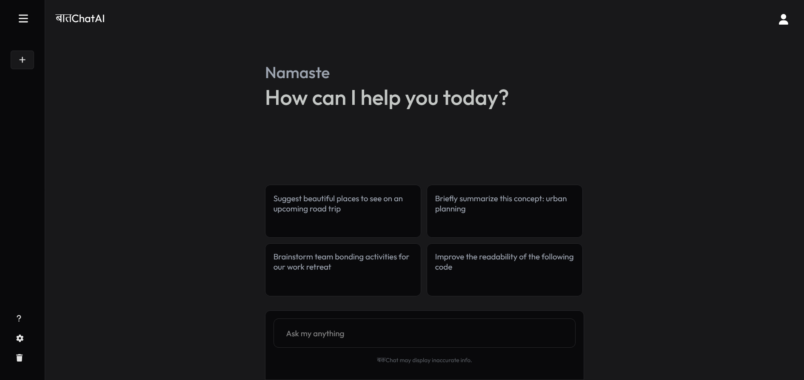

# BaatChatAI
BaatChatAI is a Generative AI chatbot built using Gemini API and Reactjs.

## 📚 Table of Contents

- 📸 [Screenshots](#screenshots)
- ✨ [Features](#features)
- 📥 [Installation](#installation)
- 🌐 [Environment Setup](#environment-setup)
- 🚀 [Usage](#usage)
- 🤝 [Contributing](#contributing)
- 📜 [License](#license)

## 📸 Screenshots


<br/><br/>


## ✨ Features

- 🤖 AI-Powered Responses: The app uses the Gemini API to provide intelligent and context-aware answers to user questions.
- 💬 Conversation History: Previous prompts and responses are stored in localStorage, allowing users to view, continue and delete past conversations.
- 🖥️ User-Friendly Interface: A clean and modern UI built with React, making it easy to interact with the AI.
- ⚡ Fast and Responsive: Built using Vite, ensuring quick load times and a smooth user experience.
- 🔒 Secure API Integration: Environment variables are used to securely manage API keys and other sensitive data.
- 🌐 Real-Time Communication: The app provides real-time responses, making the interaction feel immediate and engaging.
- 🔄 Automatic Updates: The app automatically updates the conversation as new responses are received from the API.

## 📥 Installation

To get started with this project, clone the repository and install the necessary dependencies:

```bash
git clone https://github.com/ashish0kumar/BaatChatAI.git
cd BaatChatAI
npm install
```

## 🌐 Environment Setup

Create a .env file in the root of your project and add your Gemini API key:

```bash
VITE_GEMINI_API_KEY=your_api_key_here
```
Make sure your .env file is located at the root of the project and not inside the src or any other directory.

## 🚀 Usage

To start the development server, run:
```bash
npm run dev
```
This will start the Vite development server, and you can view your project by navigating to http://localhost:5173 in your web browser.

## 🤝 Contributing

Contributions are welcome! Please fork this repository and submit pull requests with your changes.

## 📜 License

This project is licensed under the MIT License. See the LICENSE file for details.
